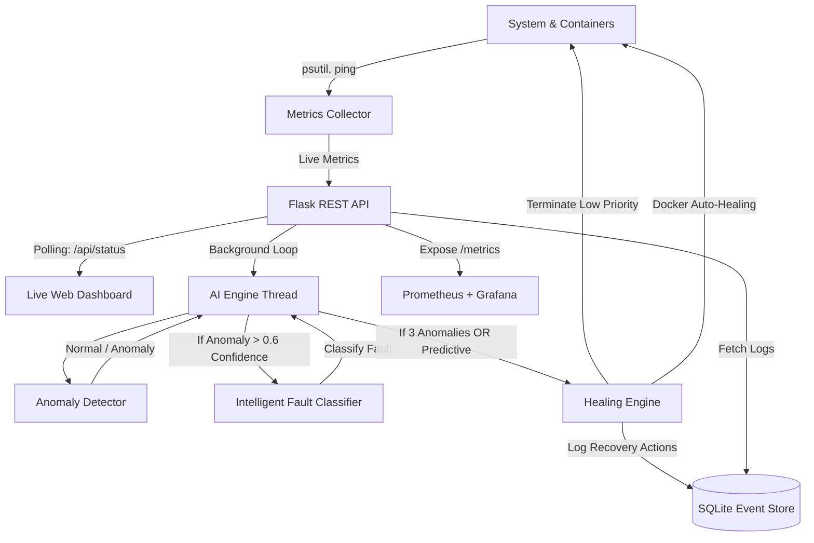

# AI-Driven Autonomous Self-Healing Infrastructure Platform

A production-ready, AI-powered self-healing system that detects infrastructure anomalies, performs intelligent fault classification, and automatically triggers preventive and reactive remediation actions with minimal human intervention.

## 🌟 Key Features
- **Intelligent Anomaly Detection**: Uses statistical and ML methods to identify deviations in real-time.
- **Rule-Based Fault Classification**: Precisely classifies issues (e.g., `CPU_OVERLOAD`, `MEMORY_OVERLOAD`, `DISK_OVERLOAD`, `NETWORK_LATENCY`).
- **Predictive Healing**: Anticipates crashes before they occur by tracking resource usage trends (e.g., strictly increasing CPU > 80%).
- **Automated Remediation**: Kills low-priority resource hogs, resets network interfaces, and includes fallback Docker Auto-Healing.
- **Live AI Dashboard**: Real-time monitoring UI with AI Decision Logs, process tracking, and resource charts polling every 3 seconds.

---

## 🏗️ Architecture Diagram



---

## 🔄 The Self-Healing Workflow

1. **Metrics Collection**: `metrics_collector.py` tracks CPU, Memory, Disk I/O, and Ping at 1-second intervals.
2. **Predictive Analysis**: The AI Engine (`start_ml_engine` in `api.py`) evaluates the history deque. If CPU is strictly increasing and crosses 80%, it triggers **Predictive Healing**.
3. **Anomaly Detection**: If the trend isn't strictly predictable, Z-score analysis identifies sudden deviations (anomalies).
4. **Fault Classification**: `fault_classifier.py` evaluates the metric payload to categorize the exact bottleneck (`CPU_OVERLOAD`, `NETWORK_LATENCY`, etc.).
5. **Healing Execution**: `healing_engine.py` terminates specific low-priority processes, restarts networking, or executes `docker restart` commands.
6. **Live Logging**: Events are saved to SQLite and immediately broadcast to the dashboard's "AI Decision Logs".

---

## 📸 Dashboard Preview

*The dashboard features a live AI Decision log, top process monitoring, and real-time Chart.js graphs.*

*(Please run the app and visit `http://localhost:5000` to view the dashboard)*

---

## 🚀 Quick Start

1. **Install Dependencies**
```bash
pip install -r requirements.txt
```

2. **Run the AI Platform**
```bash
python src/api.py
```

3. **Access the Dashboard**
Open your browser to: [http://localhost:5000](http://localhost:5000)

---

## 🎬 Best Final Demo Flow (For Presentation/Viva)

To impress evaluators, follow this exact sequence during your presentation:

1. **Open Dashboard (Healthy System)**
   - Show the dashboard at `http://localhost:5000`.
   - Point out the `NORMAL` state, low CPU usage, and the live process table.

2. **Run CPU Stress Test**
   - In a new terminal, execute:
     ```bash
     python stress_tests/cpu_stress.py
     ```
   - *Explain*: "This script utilizes all CPU cores to simulate a runaway process or DDoS attack."

3. **Watch the Dashboard Update**
   - The CPU chart will spike to 95%+.
   - The System State will begin blinking `DEGRADED`.
   - The AI Decision Log will output: `[AI ENGINE] Anomaly Detected: CPU_OVERLOAD`.

4. **Predictive or Reactive Healing Triggered**
   - The AI Engine recognizes the pattern.
   - The State changes to `HEALING`.
   - The log will show: `[AI ACTION] AI Action: LOW priority process terminated`.
   
5. **System Stabilizes**
   - Stop the stress test manually or wait for the system to aggressively terminate low-priority tasks.
   - The System State returns to `NORMAL`.
   - *Explain*: "The AI successfully identified the bottleneck, classified it, executed a targeted recovery action, and stabilized the infrastructure without human intervention."

---

## 🛠️ Built With
- **Backend**: Python, Flask, SQLite
- **AI/ML**: Scikit-Learn, Pandas, psutil
- **Frontend**: HTML5, CSS3, JavaScript, Chart.js
- **Observability**: Prometheus, Grafana